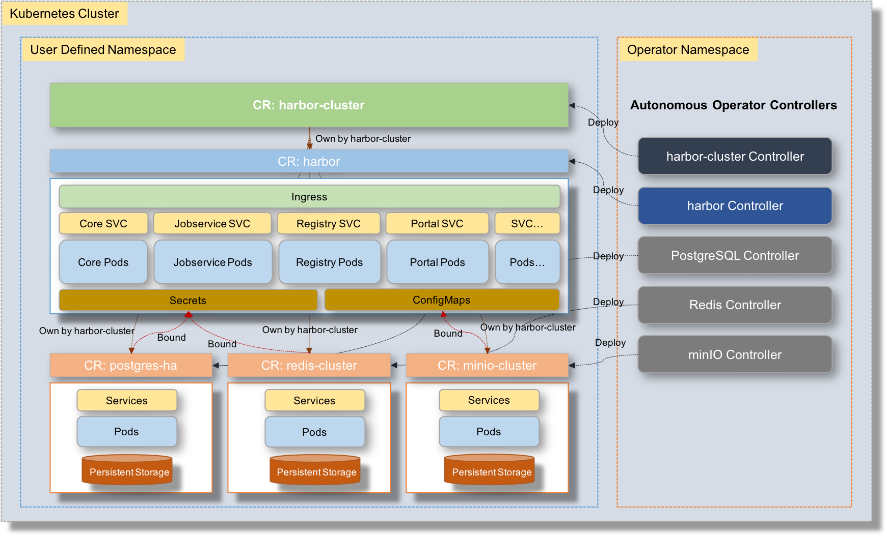

# Harbor cluster operator design

## Overview

The overall design of the operator is shown below:

- A top CR(Customize Resource) `harbor-cluster` is defined to represent the full harbor stack. It is governed by the 
corresponding controller.
- The harbor service components are created and managed through the [harbor operator](https://github.com/goharbor/harbor-operator) and the CR `harbor`.
- The following related CRs of the dependent services will be created and managed by their operator controllers and bound 
to the `Harbor` CR via [secret](https://kubernetes.io/docs/concepts/configuration/secret/) or [configMaps](https://kubernetes.io/docs/tasks/configure-pod-container/configure-pod-configmap/) ways. Sometimes, the configurations of dependencies may be directly populated 
into the pods of CR `Harbor` to reduce the difficulties.
  - Database service (PostgresSQL)
  - Cache service (Redis)
  - Storage service (minIO)
- The dependent CRs are owned by the `harbor-cluster` CR to enable the cascaded deletion and GC when the CR `harbor-cluster` 
is deleted.

## CRD

This [document](cr_HarborCluster_spec.md) explains the various fields supported in spec of CR `harbor-cluster`  and how to use these fields to deploy harbor cluster.

## Reconcile flow

[TBD]

## Misc

[TBD]