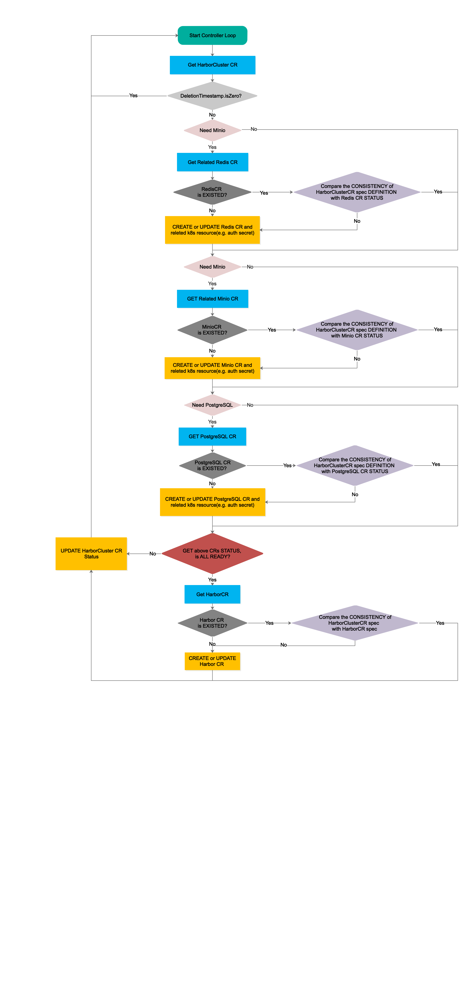

# Harbor Cluster Reconciler

## Control Loop

 

### The Criterion of READY

   The important point of Control Loop is how to evaluate the CRs(Redis, PostgreSql, Minio) status is READY.
   When all of the three dependencies is READY, operator can create the Harbor CR.

 - Redis
    
    When the available replicas of redis is equal to `.spec.redis.replicas` in Redis CR. 
    And the available replicas of redis sentinel is equal to `.spec.sentinel.replicas` is Redis CR.
    
 - PostgreSQL
    
    In Postgres CR's status, there is string field named `PostgresClusterStatus`, which indicates whether the PostgreSQL services is Healthy.
    In current stage, we directly use it to evaluate the PostgreSQL is ready when this field is equal to `running`.
    
 - MinIO
 
    In Minio CR's status, there is int32 field named `AvailableReplicas`, which indicates the available replicas of MinIO instance.
    So, when `.status.availableReplicas` is equal to `.spec.replicas`, it is ready. 
    
### Resource Status 

```yaml
status:
  conditions:
  - # type values may be Cache, Database, Storage, HarborCore  
    type: Cache
    # status values may be True, False, or Unknown. The absence of a condition should be interpreted the same as Unknown. How controllers handle Unknown depends on the Condition in question.
    status: True
    # optional
    message: may contain specific details
    # optional
    lastTransitionTime: 2020-03-29T15:05:42Z

```
    